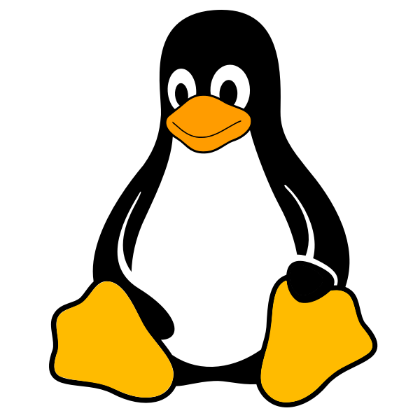

# Gabriel Belmonte

**Técnico em Informática | Estudante de Redes de Computadores**

Interesse em infraestrutura, suporte e cibersegurança.

---

## Conhecimentos

### Redes e infraestrutura

 

### Desenvolvimento

## Contato

